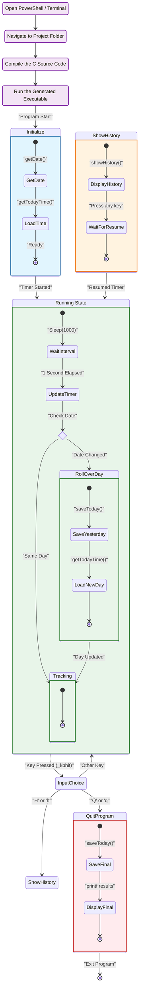

```mermaid
stateDiagram-v2

state "Open PowerShell / Terminal" as OpenTerminal
state "Navigate to Project Folder" as NavFolder
state "Compile the C Source Code" as Compile
state "Run the Generated Executable" as RunExe

OpenTerminal --> NavFolder
NavFolder --> Compile
Compile --> RunExe
RunExe --> Init : "Program Start"

state "Initialize" as Init {
    [*] --> GetDate : "getDate()"
    GetDate --> LoadTime : "getTodayTime()"
    LoadTime --> [*] : "Ready"
}

Init --> Running : "Timer Started"

state "Running State" as Running {
    [*] --> WaitInterval : "Sleep(1000)"
    WaitInterval --> UpdateTimer : "1 Second Elapsed"

    state DateCheckChoice <<choice>>
    UpdateTimer --> DateCheckChoice : "Check Date"

    DateCheckChoice --> Tracking : "Same Day"
    DateCheckChoice --> RollOver : "Date Changed"

    state "Tracking" as Tracking {
        [*] --> [*]
    }

    state "RollOverDay" as RollOver {
        [*] --> SaveYesterday : "saveToday()"
        SaveYesterday --> LoadNewDay : "getTodayTime()"
        LoadNewDay --> [*]
    }

    RollOver --> Tracking : "Day Updated"
}

Running --> InputChoice : "Key Pressed (_kbhit)"

state InputChoice <<choice>>
InputChoice --> Running : "Other Key"
InputChoice --> ShowHistory : "'H' or 'h'"
InputChoice --> Quit : "'Q' or 'q'"

state "ShowHistory" as History {
    [*] --> DisplayHistory : "showHistory()"
    DisplayHistory --> WaitForResume : "Press any key"
    WaitForResume --> [*]
}

History --> Running : "Resumed Timer"

state "QuitProgram" as Quit {
    [*] --> SaveFinal : "saveToday()"
    SaveFinal --> DisplayFinal : "printf results"
    DisplayFinal --> [*]
}

Quit --> [*] : "Exit Program"

classDef setupStyle fill:#f3e5f5,stroke:#7b1fa2,stroke-width:2px;
classDef initStyle fill:#e1f5fe,stroke:#01579b,stroke-width:2px;
classDef runStyle fill:#e8f5e9,stroke:#2e7d32,stroke-width:2px;
classDef histStyle fill:#fff3e0,stroke:#ef6c00,stroke-width:2px;
classDef quitStyle fill:#ffebee,stroke:#c62828,stroke-width:2px;

class OpenTerminal,NavFolder,Compile,RunExe setupStyle
class Init initStyle
class Running,Tracking,RollOver runStyle
class History histStyle
class Quit quitStyle
```
