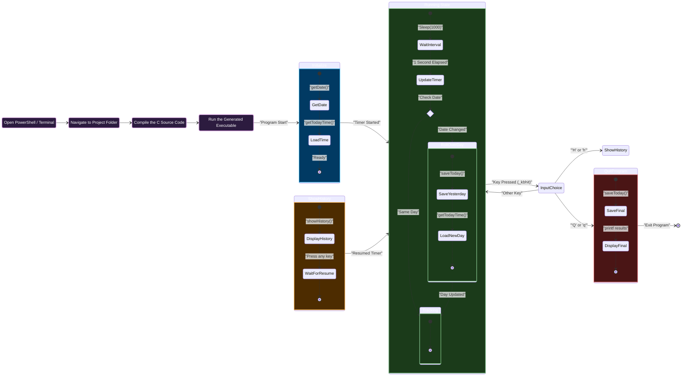

```mermaid
stateDiagram-v2
    direction LR

    state "Open PowerShell / Terminal" as OpenTerminal
    state "Navigate to Project Folder" as NavFolder
    state "Compile the C Source Code" as Compile
    state "Run the Generated Executable" as RunExe

    OpenTerminal --> NavFolder
    NavFolder --> Compile
    Compile --> RunExe
    RunExe --> Init : "Program Start"

    state "Initialize" as Init {
        [*] --> GetDate : "getDate()"
        GetDate --> LoadTime : "getTodayTime()"
        LoadTime --> [*] : "Ready"
    }

    Init --> Running : "Timer Started"

    state "Running State" as Running {
        [*] --> WaitInterval : "Sleep(1000)"
        WaitInterval --> UpdateTimer : "1 Second Elapsed"

        state DateCheckChoice <<choice>>
        UpdateTimer --> DateCheckChoice : "Check Date"

        DateCheckChoice --> Tracking : "Same Day"
        DateCheckChoice --> RollOver : "Date Changed"

        state "Tracking" as Tracking {
            [*] --> [*]
        }

        state "RollOverDay" as RollOver {
            [*] --> SaveYesterday : "saveToday()"
            SaveYesterday --> LoadNewDay : "getTodayTime()"
            LoadNewDay --> [*]
        }

        RollOver --> Tracking : "Day Updated"
    }

    Running --> InputChoice : "Key Pressed (_kbhit)"

    state InputChoice <<choice>>
    InputChoice --> Running : "Other Key"
    InputChoice --> ShowHistory : "'H' or 'h'"
    InputChoice --> Quit : "'Q' or 'q'"

    state "ShowHistory" as History {
        [*] --> DisplayHistory : "showHistory()"
        DisplayHistory --> WaitForResume : "Press any key"
        WaitForResume --> [*]
    }

    History --> Running : "Resumed Timer"

    state "QuitProgram" as Quit {
        [*] --> SaveFinal : "saveToday()"
        SaveFinal --> DisplayFinal : "printf results"
        DisplayFinal --> [*]
    }

    Quit --> [*] : "Exit Program"

    classDef setupStyle fill:#2c1b3f,stroke:#ce93d8,stroke-width:2px,color:#ffffff;
    classDef initStyle fill:#013a63,stroke:#4fc3f7,stroke-width:2px,color:#ffffff;
    classDef runStyle fill:#1b3b1a,stroke:#81c784,stroke-width:2px,color:#ffffff;
    classDef histStyle fill:#4d2c00,stroke:#ffb74d,stroke-width:2px,color:#ffffff;
    classDef quitStyle fill:#4a1515,stroke:#e57373,stroke-width:2px,color:#ffffff;

    class OpenTerminal,NavFolder,Compile,RunExe setupStyle
    class Init initStyle
    class Running,Tracking,RollOver runStyle
    class History histStyle
    class Quit quitStyle
```
