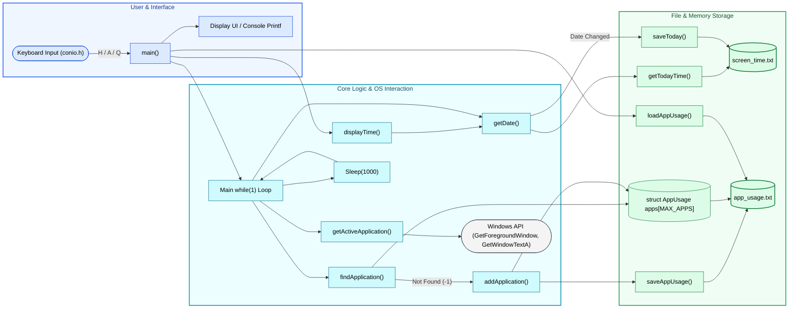

```mermaid
flowchart LR
    subgraph clientLayer ["User & Interface"]
        KB(["Keyboard Input (conio.h)"]):::clientNode
        MAIN["main()"]:::clientNode
        UI_DISP["Display UI / Console Printf"]:::clientNode
    end
    subgraph backendLayer ["Core Logic & OS Interaction"]
        DISP_TIME["displayTime()"]:::backendNode
        LOOP["Main while(1) Loop"]:::backendNode
        GET_DATE["getDate()"]:::backendNode
        FIND_APP["findApplication()"]:::backendNode
        ADD_APP["addApplication()"]:::backendNode
        SLEEP["Sleep(1000)"]:::backendNode
        GET_ACTIVE["getActiveApplication()"]:::backendNode
        WIN_API(["Windows API (GetForegroundWindow, GetWindowTextA)"]):::extNode
    end
    subgraph dataLayer ["File & Memory Storage"]
        GET_TODAY["getTodayTime()"]:::dataNode
        SAVE_TODAY["saveToday()"]:::dataNode
        SAVE_APP["saveAppUsage()"]:::dataNode
        STRUCT_APP[("struct AppUsage apps[MAX_APPS]")]:::dataNode
        LOAD_APP["loadAppUsage()"]:::dataNode
        DB_SCREEN[("screen_time.txt")]:::dataNode
        DB_APP[("app_usage.txt")]:::dataNode
    end
    KB -->|"H / A / Q"| MAIN
    MAIN --> UI_DISP
    MAIN --> DISP_TIME
    MAIN --> LOOP
    MAIN --> LOAD_APP
    DISP_TIME --> GET_DATE
    LOOP --> SLEEP
    SLEEP --> LOOP
    LOOP --> GET_DATE
    LOOP --> FIND_APP
    LOOP --> GET_ACTIVE
    FIND_APP -->|"Not Found (-1)"| ADD_APP
    GET_DATE -->|"Date Changed"| SAVE_TODAY
    GET_DATE --> GET_TODAY
    GET_ACTIVE --> WIN_API
    GET_TODAY --> DB_SCREEN
    SAVE_TODAY --> DB_SCREEN
    ADD_APP --> SAVE_APP
    FIND_APP --> STRUCT_APP
    ADD_APP --> STRUCT_APP
    SAVE_APP --> DB_APP
    STRUCT_APP --> DB_APP
    LOAD_APP --> DB_APP
    style clientLayer fill:#eff6ff, stroke:#2563eb, stroke-width:2px, color:#1e3a8a
    style backendLayer fill:#ecfeff, stroke:#0891b2, stroke-width:2px, color:#164e63
    style dataLayer fill:#f0fdf4, stroke:#16a34a, stroke-width:2px, color:#14532d
    classDef clientNode fill:#dbeafe, stroke:#1d4ed8, color:#000000
    classDef backendNode fill:#cffafe, stroke:#0e7490, color:#000000
    classDef dataNode fill:#dcfce7, stroke:#15803d, color:#000000
    classDef extNode fill:#f4f4f5, stroke:#4b5563, color:#000000
    style DB_SCREEN fill:#dcfce7,color:#000,stroke:#15803d,stroke-width:2px
    style DB_APP fill:#dcfce7,color:#000,stroke:#15803d,stroke-width:2px
```
